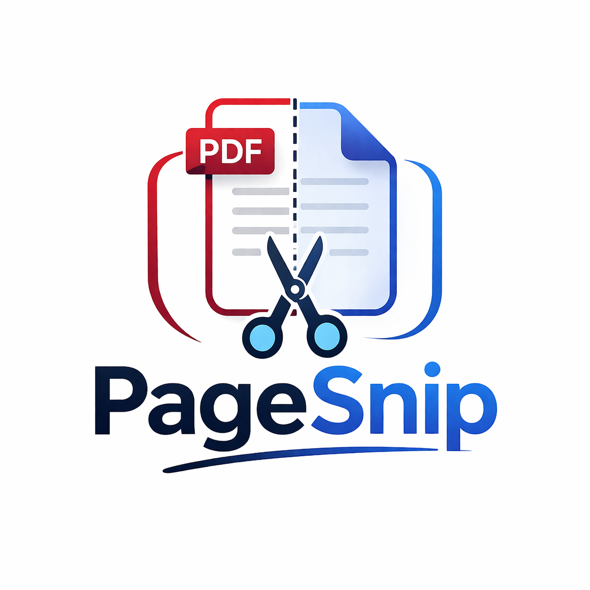

<p align="center">
  
</p>

<h1 align="center">AutoMIDIcally</h1>

<p align="center">
  AI-powered MIDI pattern generator — melodies, chords, drums, and bass lines,<br/>
  previewed in-browser and exported as <code>.mid</code> files ready for FL Studio, Logic Pro, or Ableton Live.
</p>

<p align="center">
  
  
  
  
  
</p>

---

## Features

| | |
|---|---|
| **4 pattern types** | Melody · Chord Progression · Drum Pattern · Bass Line |
| **24 keys** | All 12 chromatic roots × Major + Minor |
| **6 vibe presets** | Cinematic · Lo-fi · Hyperpop · Afrobeats · Jazz · Dark Trap |
| **Piano roll preview** | Scrollable SVG grid, updates in real time (300 ms debounce) |
| **In-browser audio** | Tone.js synths — play before you export |
| **MIDI export** | Type 1 `.mid` with tempo track, natural velocity variation |

## Quick start

```bash
npm install
npm run dev        # → http://localhost:5173
```

## Usage

1. **Pick a pattern type** — Melody, Chords, Drums, or Bass Line
2. **Set your key, BPM, bars, density, and vibe**
3. **Hit Play** to preview in-browser with Tone.js
4. **Export** — downloads `automidically_{type}_{key}_{bpm}bpm.mid`
5. Drag the `.mid` file straight into FL Studio, Logic, or Ableton

## Project structure

```
src/
├── engine/
│   ├── scaleUtils.ts       ← music theory primitives (scales, chords, 24 keys)
│   ├── vibePresets.ts      ← 6 genre/mood configs
│   ├── melodyEngine.ts     ← monophonic voice-leading melody
│   ├── chordEngine.ts      ← diatonic chord progressions
│   ├── drumEngine.ts       ← 16-step GM drum patterns
│   ├── bassEngine.ts       ← root + passing-tone bass lines
│   └── midiGenerator.ts   ← orchestrator + @tonejs/midi serializer
├── hooks/
│   ├── useMidiGeneration.ts
│   └── useAudioPreview.ts
├── components/
│   ├── PatternTypeSelector.tsx
│   ├── ParameterPanel.tsx
│   ├── PianoRoll.tsx
│   ├── AudioPreview.tsx
│   └── ExportPanel.tsx
└── types/midi.ts
```

## Architecture notes

- **480 PPQ** — standard DAW tick resolution; 16th note = 120 ticks
- **C4 = 60** — standard MIDI convention enforced throughout
- **Pure function engines** — each takes `GenerationParams + VibeConfig → MidiNote[]`
- **Seeded RNG** — reproducible patterns; same params → same output
- **No backend** — everything runs in-browser; no API keys required for Phase 1

## Tech stack

| | |
|---|---|
| Frontend | React 18 + Vite + TypeScript (strict) |
| Styling | Tailwind CSS |
| MIDI | [@tonejs/midi](https://github.com/Tonejs/Midi) |
| Audio preview | [Tone.js](https://tonejs.github.io/) |
| Tests | Vitest — 41 tests |

## Scripts

```bash
npm run dev      # dev server
npm run build    # production build
npm run test     # run unit tests
npm run lint     # eslint
```

## Roadmap

- [x] Phase 1 — Rule-based MIDI generation, piano roll, export
- [ ] Phase 2 — AI sample generation (ElevenLabs / Meta AudioCraft)
- [ ] Phase 2 — Session sample library
- [ ] Tension parameter for intentional out-of-key notes
- [ ] Magenta.js integration for ML-driven generation

---

<p align="center">Made with React + Tone.js · Export to any DAW</p>
